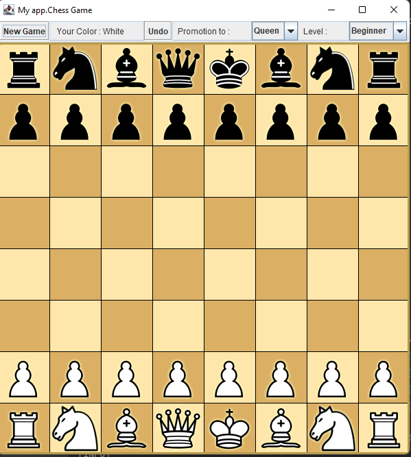
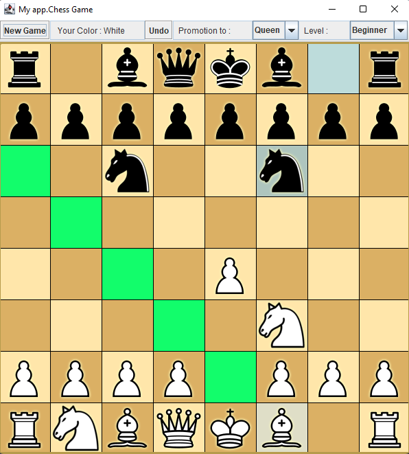

# Chess App #

My chess application written in java using nega-max algorithm and alpha beta pruning

### Maximum depth reached is 7 :) ###

## How to play? ##
1. you can choose the level of the computer engine, there are  3 levels: beginner, casual and advanced.
    the differences between them is the depth of the calculation tree of the engine
2. you can undo your moves with the undo button
3. you can choose your preferred promotion type
4. unfortunately, you can only play with white pieces
5. to play a move, you first have to choose the piece you want to move with, then the square you want to move to.
    if, after picking a piece to move with you change your mind, you have to click again to undo your pick
6. have fun!



## Color Meaning
* Possible moves highlighted with green
* last move highlighted with light blue
* current piece picked highlighted with light gray
##



### Compile and Run ###
```bash
mvn clean install;
mvn exec:java;
```

### Contact ###
If you have any questions, comments, or feedback about this app, please feel free to contact me at itaybardan@gmail.com.